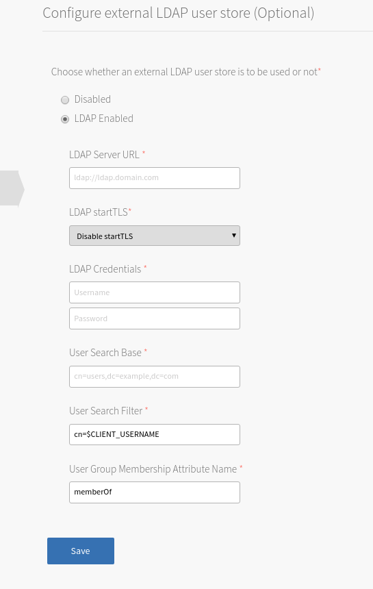

## Overview

## Goals

The goal of this tutorial is to demonstrate extracting the information from the application's Cloud Foundry Service Bindings and connect to the Solace Messaging service instance.  This tutorial will show you:

1. How to configure an LDAP server with some example ldif files 
1. How to use the credentials on the LDAP server to authenticate and authorize 

## Assumptions

This tutorial assumes the following:

* You are familiar with Solace [core concepts]({{ site.docs-core-concepts }}){:target="_top"}.
* You are familiar with [Cloud Foundry](https://www.cloudfoundry.org/){:target="_blank"}.
* You have access to a running Pivotal Cloud Foundry environment.
* Solace Messaging for PCF has been installed in your Pivotal Cloud Foundry environment.
* You have completed the Java app tutorial.
* You are using OpenLDAP. Some things may be different if you are using a different LDAP implementation. 

## Files

#### memberOf.ldif

The memberOf overlay is mainly for convenience. 

With the memberOf overlay whenever the list of members in a group is updated, that member allomatically gets updated with the correct memberOf attribute as well. This means only updating one place instead of two. 

Without the memberOf overlay, a memberOf attribute for every user to be updated manually with the correct groups.

```
dn: cn=modulecn=config
objectClass: olcModuleList
cn: module
olcModulePath: /usr/lib64/openldap
olcModuleLoad: memberof

dn: olcOverlay=memberofolcDatabase={2}bdbcn=config
objectClass: olcMemberOf
objectClass: olcOverlayConfig
objectClass: olcConfig
objectClass: top
olcOverlay: memberof
olcMemberOfDangling: ignore
olcMemberOfRefInt: TRUE
olcMemberOfGroupOC: groupOfNames
olcMemberOfMemberAD: member
olcMemberOfMemberOfAD: memberOf
```

#### content.ldif

Here is an example of how to configure a running LDAP server, with user 'hank' belonging to group 'finance'. 

```
dn: dc=vandelay,dc=com
changetype: add
dc: vandelay
objectClass: dcObject
objectClass: top
objectClass: organization
o: vandelay

dn: ou=cli,dc=vandelay,dc=com
changetype: add
objectClass: organizationalUnit
objectClass: top
ou: cli

dn: ou=groups,dc=vandelay,dc=com
changetype: add
objectClass: organizationalUnit
objectClass: top
ou: groups

dn: cn=hank,ou=cli,dc=vandelay,dc=com
changetype: add
objectClass: organizationalPerson
objectClass: person
objectClass: top
sn: hank
cn: hank
userPassword: hunter2

dn: cn=finance,ou=groups,dc=vandelay,dc=com
changetype: add
objectClass: groupOfNames
objectClass: top
member: cn=hank,ou=cli,dc=vandelay,dc=com
cn: finance
```
#### Commands

These commands will add the above files to the LDAP server.

```
ldapadd -Y EXTERNAL -H ldapi:/// -f /home/ec2-user/memberOf.ldif
ldapadd -x -D 'bindDNUser' -w bindDNPassword -H ldapi:/// -f /home/ec2-user/content.ldif
```

Where bindDNUser and binDNPassword are the bind DN credentials (if there is one).

## Setup


